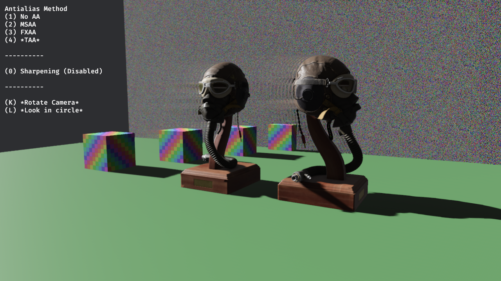
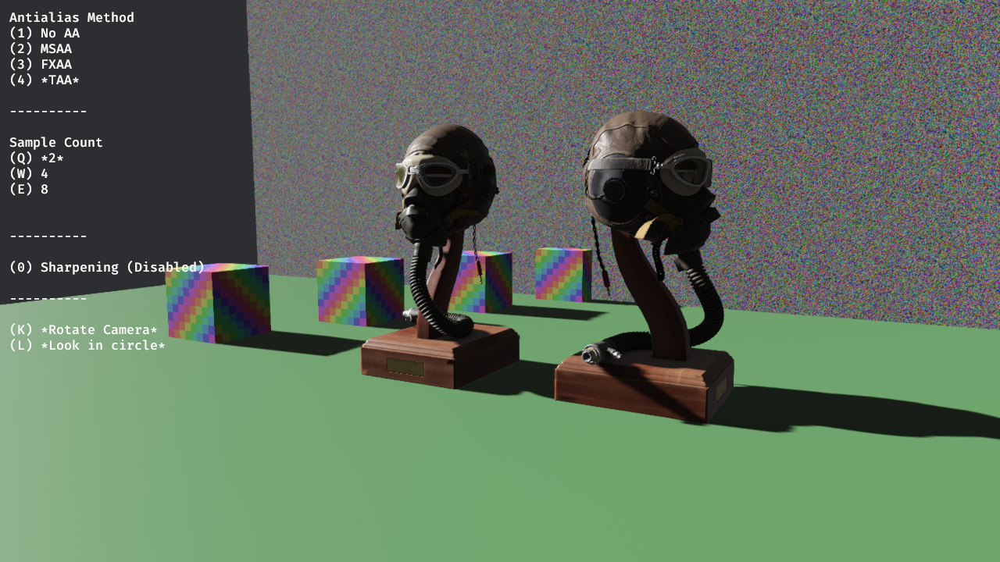

# Temporal Anti Aliasing for Bevy

WIP

Depends on bevy 0.13

`bevy_mod_taa` addresses a few issues related to smearing over disoccluded areas, and also favors sharper blending overall. 

It also has a mode `TAABundle::sample2()` that somewhat resembles the [TAA method used in Horizon Zero Dawn](https://advances.realtimerendering.com/s2017/DecimaSiggraph2017.pdf) (P. 29) that only uses the previous frame to minimize ghosting/smearing artifacts.

Example screenshots under heavy motion:

*bevy_mod_taa*

*bevy 0.12*

*bevy_mod_taa sample2*