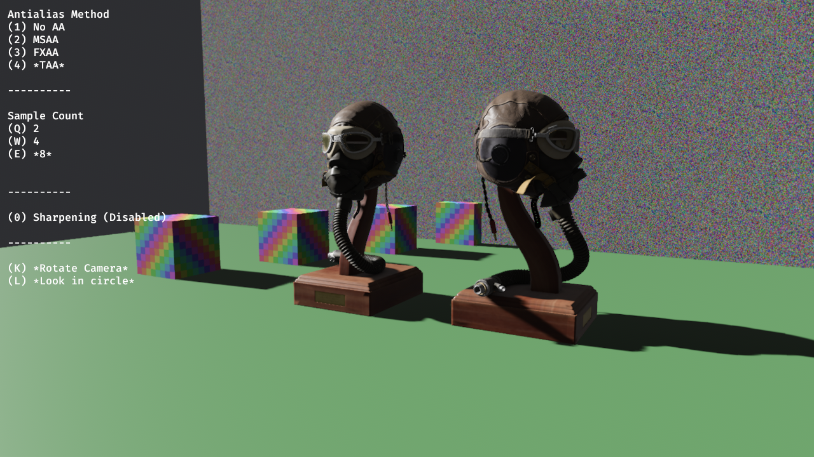
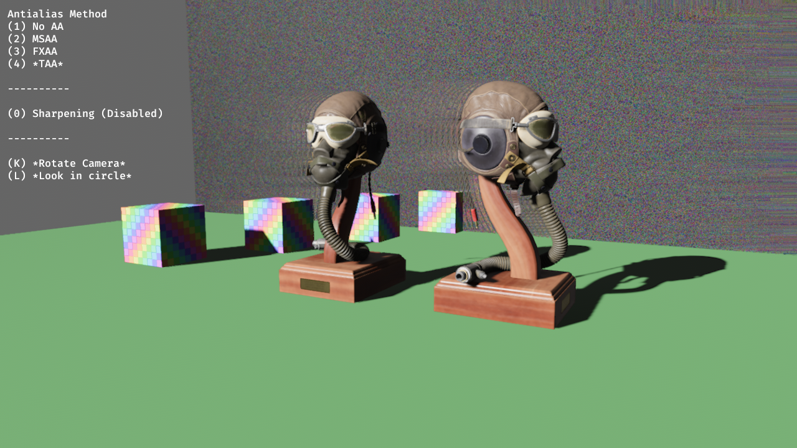

# Temporal Anti Aliasing for Bevy

In its current state, `bevy_mod_taa` somewhat closely resembles bevy's builtin experimental TAA. It addresses a few issues related to smearing over disoccluded areas, and also favors sharper blending overall. In the future this plugin will significantly diverge from bevy's builtin TAA in order to better handle a much larger variety of scenes.

Currently depends on the bevy main branch. After the 0.12 release this `bevy_mod_taa` will depend on bevy 0.12

*bevy_mod_taa*

*bevy main*